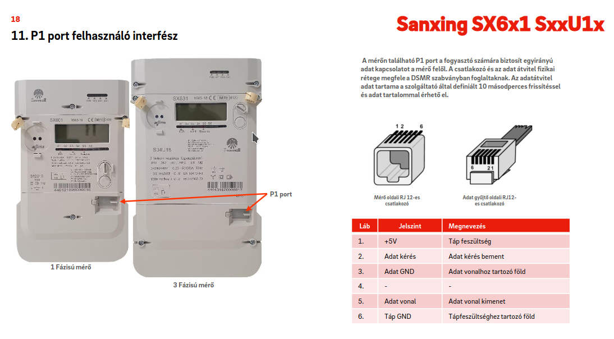
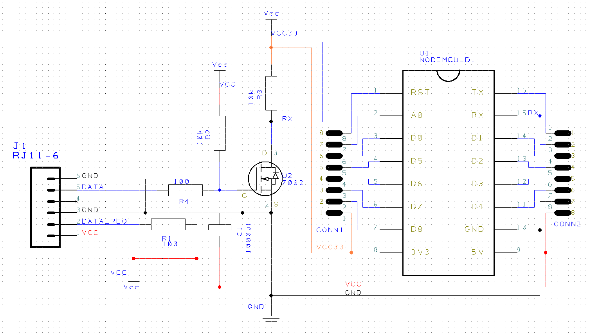
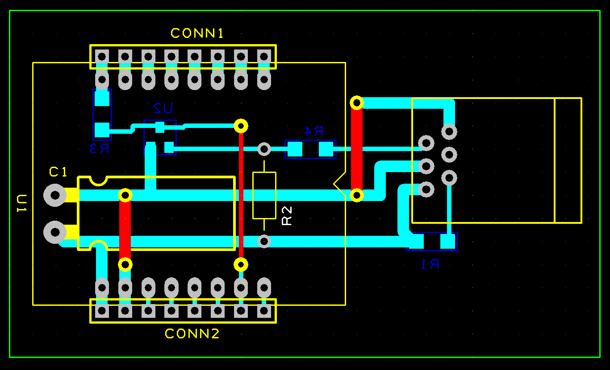
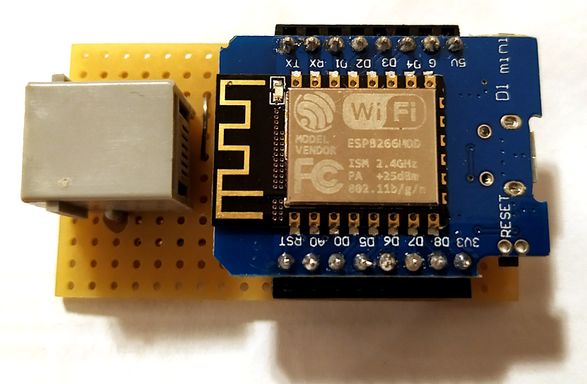

- [Okosmérés, a lakás fogyasztásának mentése](#okosmérés-a-lakás-fogyasztásának-mentése)
  - [Elvi működés:](#elvi-működés)
  - [Az okosmérő fogyasztásának leolvasása](#az-okosmérő-fogyasztásának-leolvasása)
    - [P1 port](#p1-port)
    - [Nehézségek a kapcsolásnál](#nehézségek-a-kapcsolásnál)
    - [A kapcsolási rajz](#a-kapcsolási-rajz)
    - [PCB terv](#pcb-terv)
    - [Megvalósítás](#megvalósítás)
      - [Alsó szint: a vezetékek és SMD](#alsó-szint-a-vezetékek-és-smd)
      - [Felső szint: furatszerelt cuccok és átkötések](#felső-szint-furatszerelt-cuccok-és-átkötések)
      - [Végeredmény](#végeredmény)
      - [Egy fotó a mérőóráról](#egy-fotó-a-mérőóráról)
  - [Az MQTT adatok elmentése](#az-mqtt-adatok-elmentése)
  - [A webalkalmazás](#a-webalkalmazás)

# Okosmérés, a lakás fogyasztásának mentése
A modern okosmérők rendelkeznek egy P1 nevű felhasználói porttal, amely képes az aktuális fogyasztási/termelési adatainkat 10 másodperces bontásban a rendelkezésünkre bocsájtani. A hivatalos kommunikáció szerint ezt a portot az ügyfél szabadon használhatja tetszőleges eszközzel. Lássunk is neki az energiafogyasztás naplózásának!

## Elvi működés:

* az okosmérő 10 másodpercenként soros protokollal küldi a jeleket (UART)
* egy ESP8266-os mikrovezérlő fogadja az adatokat és WiFi-n az MQTT szerver felé továbbítja
* az MQTT szervert egy Raspberry Pi biztosítja a lakásban
* egy szkript segítségével meg az MQTT szerverről elmentjük az adatokat CSV fájlokba napi bontásban
* webalkalmazás, mellyel az elmentett adatokat megtekinthetjük

Az okosmérő összes adatát továbbküldjük JSON-ná konvertálva. Ez azért fontos, hogy később, ha valamilyen adatra szükség lesz, mindig rendelkezésre álljon, akár több évre visszamenőleg is. A CSV kevesebb adatot fog tartalmazni, csak ami érdekel minket.

## Az okosmérő fogyasztásának leolvasása

### P1 port

 A P1 port biztosítja a felhasználóknak a fogyasztási adatokat.

### Nehézségek a kapcsolásnál

* A dokumentáció maximálisan 250 mA-es áram felvételét engedélyezi a P1 porton, viszont az ESP8266 WiFi használatkor a 300 mA-t simán elérheti. A megoldás egyszerű, egy 1000uF-es kondenzátorral eltároljuk az energiát amikor éppen nem WiFi-zünk és rásegítünk vele, ha szükséges a nagyobb áram. Sokan kihagyják ezt a kapacitást, mert enélkül is megy a cucc, lelkük rajta, személyes tapasztalat alapján valóban megy.
* A másik nehézség, hogy az okosmérő invertálva küldi az adatokat. Az ESP8266 hardveresen képtelen fogadni az invertált adatokat. Sokan szoftveresen orvosolják a bajt, de ezzel fenntartásaim vannak. Az ESP8266 nem egy teljesítménybajnok mikrovezérlő, a WiFi kommunikáció kimondottan igénybeveszi a rendszert. Könnyen elképzelhető, hogy WiFi-zés alatt kimaradnak bitek és adatvesztés történik. Nem a világ vége berakni egy tranzisztort és 2 felhúzó ellenállást, hogy megfordítsunk egy logikai jelet.

### A kapcsolási rajz

Nem túl bonyolult: tartalmaz egy tranzisztort jelfordításra, két 10k-s felhúzóellenállást és két 100 ohmos ellenállást (védelmi funkció, elhagyható, ha félrekötnénk valamit, a mérő biztosan nem fog megsülni), meg egy 1000uF-es kondenzátort. A mikrovezérlő Wemos D1 V2, de bármelyik ESP8266-os panel megfelel erre a célra. Használhatunk Nodemcu-t is ha nincs épp más otthon.

### PCB terv

A DesignSpark ingyenesen használható cucc, könnyű vele úgy megtervezni az áramkört, hogy kisebb legyen egy fagyasztóládánál. Már az ilyen mini kapcsolások esetén is érdemes használni, mert a monitor előtt ülve kötözgethetünk össze-vissza az elemeket, aztán ha nem sikerül elsőre, hát átrajzoljuk.

Egyoldalas nyákokat szoktam csinálni, alulra pakolom az SMD cuccokat, felülre meg a furatszerelteket.

A mikrovezérlő lábaihoz duplafoglalatot szoktam tenni, mert ha valami megpusztulna, simán nyomkövetni tudom egy logikai jelanalizátorral. Nem kell csipesz, meg semmi más, csak bedugom a mérőkábelt és mérek.

### Megvalósítás

Le lehet legyártatni a panelt profi cégekkel, bár ezt sosem szoktam csinálni. Jó sok lóvé és várhatsz két hetet is, amíg megérkezik a végeredmény a postán. Ha meg valamit eltoltál, újrázhatsz. Ehelyett az ember előkapja a prototípus panelt és alkot.

#### Alsó szint: a vezetékek és SMD

Meglehetősen igénytelen, de a világ végezetéig elműködik. Egy tömör huzalról lehúzom a szigetelést, az lesz a vezeték. Itt-ott azért hozzáforrasztom a panelhez, hogy ne lógjon a vakvilágba. A forrszemeket az SMD1206-nál ki kell kaparni. Egy multiméterrel azért érdemes megnézni, hogy nincs-e rövidzár valahol.

#### Felső szint: furatszerelt cuccok és átkötések

Ide rakjuk az átkötéseket és a nagyobb furatszerelt cuccokat.

#### Végeredmény

A mikrovezérlőt behelyezzük a dupla foglalatsorba középre, ha pedig mérni támad kedvünk bedughatjuk mellé a mérőkábelt is (ezért a duplasor).

Ha utólag megvilágosodunk, hogy bővíteni kellene a rendszert, a tetejére illesztünk egy másik panelt tüskesorral. Ugye nem muszáj csak az alsó és felső oldalon megépíteni a prototípus panelt, simán mehetünk több emelettel a térben felfelé is és lefelé is. :)

#### Egy fotó a mérőóráról

TBD

## Az MQTT adatok elmentése

Ahogy fentebb említettem, az MQTT szerver adatait CSV formátumban tároljuk el a könnyebb kezelhetőség miatt. Erre írtam egy szkriptet (mqtt_subscriber.py), mely a 'raspberry' könyvtárban található. A szkript létrehozza a CSV fájlokat napi bontásban és a 'public_html' könyvtár 'rt/sm' alkönyvtárában eltárolja. Erre a webalkalmazás miatt van szükség, hogy az apache2 webszerver lássa a fájlokat.

| MeterId  |        Time       |DST|Import|Export|TotalImport|TotalExport|
|----------|-------------------|---|------|------|-----------|-----------|
|9912345678|2023-08-15 15:52:00| S | 2.352| 0.0  | 8995.626  | 1590.321  |
|9912345678|2023-08-15 15:52:10| S | 2.442| 0.0  | 8995.626  | 1590.327  |

Az első oszlop a mérőóra azonosítója, a második az idő, a harmadik hogy nyári, vagy téli időszámítást használunk-e, a negyedik az aktuális fogyasztásunk kW-ban, az ötödik az aktuális termelésünk kW-ban, a hatodik a teljes fogyasztásunk az óra indulása óta, a hetedik pedig a teljes termelés.

A sok adatból, amit a mérőóra elküld, ennyi bőven elég lesz számunkra.

## A webalkalmazás

TBD
